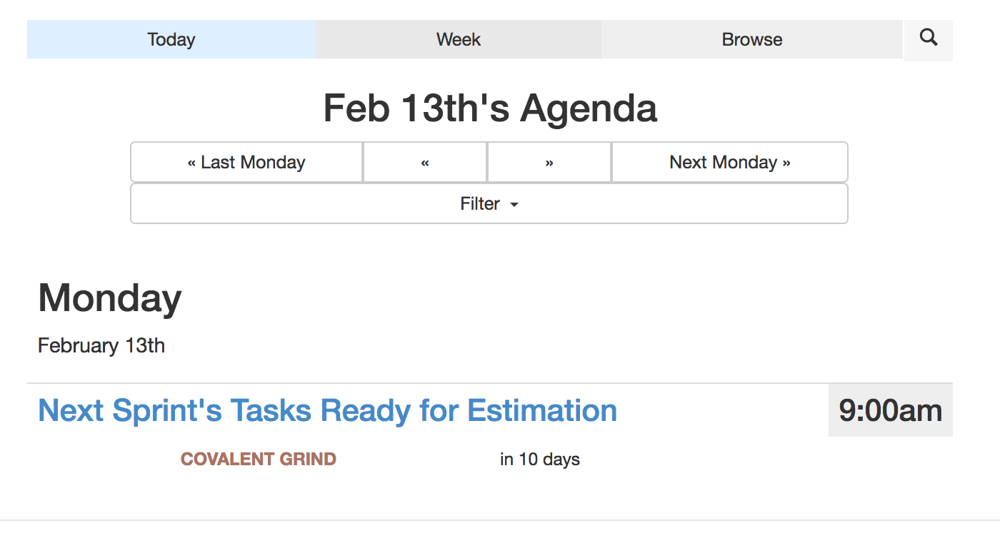

MOState Events
======

This is a full application for indexing events from multiple Google Calendars, and displaying those events.

It has searching capabilities, and was originally built mobile-first with Bootstrap.

The core functionality of this code was developed October 2014.

# Screenshots

 * [Mobile First](#mobile-first)
 * [Browsing Calendars](#browsing-calendars)
 * [Organization Settings](#organization-settings)
   * [Suspending a Calendar](#suspending-a-calendar)
   * [Deleting a Calendar](#deleting-a-calendar)
   * [Editing a Calendar](#editing-a-calendar)
 * [Search Calendars and Events](#search-calendars-and-events)
 * [Application Tutorial Pages](#application-tutorial-pages)
 * [Calendar View](#calendar-view)
 * [Day View](#day-view)
 * [Week View](#week-view)

## Mobile First

Overview of App from Mobile View.

| Search Events | Browse Multiple Calendars |
| ----- | ---- |
|  |  |
|  |  |


## Browsing Calendars

We can view all calendars which are indexed by the application.


## Organization Settings

Setting up and configuring organization.

**Control Panel**


### Suspending a Calendar

Suspending a calendar allows operators to keep track of the events and continue to keep indexes up to date,
but removes the events from being searchable or findable.


### Deleting a Calendar

Delete all data related to this calendar.


### Editing a Calendar

We can rename and categorize calendars.


## Search Calendars and Events

We create an index of all events and organization's titles and descriptions to be queried.


## Application Tutorial Pages

Provided in the application are instructions for Organizations to add their calendars through the Admin.


## Calendar View

In this view, when we click "subscribe" to the calendar, it directs us to
our Google Calendar settings page, and adds the calendar to our calendars.

For this to work, the calendar must be available to public.


## Day View

All Events happening during the selected day.




## Week View

All Events happening during the selected week.


**Applying filters to Events**


Here, we have narrowed down our selection to just `Academic` categorized calendars.


## Getting Started

Clone Repository, and install Mongodb (which we will use for our database).

Define a dev env variables file like `./dev.sh` that has contents similar to:

```sh
export ME_CLIENT_ID="956326957622-6emv3ttljhf34dcpaq2r92phs3e38kjd.apps.googleusercontent.com"
export ME_CLIENT_SECRET="CvAPPpuyixy_bghAQ34pB6eN"

# Ensure your callback URL in your Google APIs console is like: $ME_HOST/auth/~google-oauth2
# Example: https://msu-events.ngrok.io/auth/~google-oauth2
export ME_HOST="https://msu-events.ngrok.io"

export ME_OP="your-google-account-email@gmail.com"
```

Then, we can execute our app using `source ./dev.sh && npm start`

## Tutorials
 * [Creating your Google Calendar](/pages/tutorials/create-google-calendar.md)
 * [Submitting your Google Calendar](/pages/tutorials/submitting-your-google-calendar.md)
 * [Linking Google Calendar with your organization](/pages/tutorials/linking-google-calendar-with-your-organization.md)
